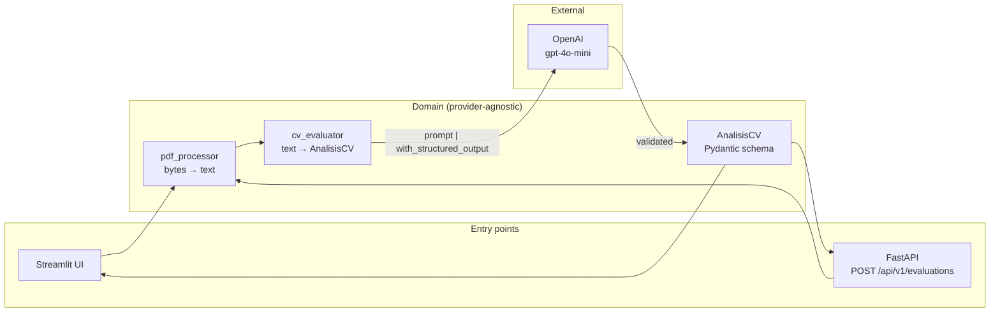

# AI-Powered CV Evaluation System

[](https://github.com/Biershoot/Sistema_de_Evaluaci-n_de_CVs_candidatos_con_IA/actions/workflows/ci.yml)
[](https://www.python.org/downloads/)
[](#testing)
[](#testing)
[](https://github.com/astral-sh/ruff)
[](LICENSE)

Turns an unstructured PDF résumé into a **typed, validated fit assessment** against a job description — via a REST API or a Streamlit UI.

The interesting problem here isn't calling an LLM. It's making a non-deterministic model behave like a dependable backend dependency: schema-enforced output, a failure taxonomy that maps cleanly onto HTTP, and a test suite that runs in under a second without touching the network or spending a cent.

---

## What it does

Upload a CV as PDF, paste a job description, and get back structured JSON:

```json
{
  "analisis": {
    "nombre_candidato": "Ana García",
    "experiencia_anios": 5,
    "habilidades_clave": ["Python", "FastAPI", "PostgreSQL", "Docker", "AWS"],
    "educacion": "Ingeniería Informática",
    "experiencia_relevante": "5 años construyendo APIs backend en Python.",
    "fortalezas": ["Sólida base en Python", "Experiencia en cloud"],
    "areas_mejora": ["Poca exposición a frontend"],
    "porcentaje_ajuste": 85
  },
  "nivel_ajuste": "excelente",
  "recomendado": true
}
```

The fit score is weighted: relevant experience 40%, technical skills 35%, education 15%, career coherence 10%.

---

## Architecture

The LLM is an implementation detail of one service, not a shape the whole codebase bends around. Both entry points call the same domain layer.



**Why this shape:** `pdf_processor` takes `bytes`, not a Streamlit upload or a FastAPI `UploadFile`. Each entry point adapts its own upload type at the boundary, so the domain layer has no framework imports and is testable with plain bytes.

---

## Engineering decisions worth explaining

These are the choices a reviewer would ask about.

### Structured output over prompt-and-parse

`with_structured_output(AnalisisCV)` binds the Pydantic model as a tool schema, so the provider returns conforming JSON instead of prose that needs regex-scraping. The model's `Field(description=...)` strings are sent to the LLM as part of that schema — they're written for the model, not just for the reader. Validation (`0 <= porcentaje_ajuste <= 100`) is enforced by Pydantic, not hoped for.

### A failure taxonomy, not a catch-all

Every failure mode is a distinct exception, mapped once to an HTTP status:

| Exception | HTTP | Meaning |
|---|---|---|
| `PDFExtractionError` | 400 | PDF corrupt, encrypted, or image-only |
| `EvaluationError` | 502 | Provider failed or returned off-schema |
| `ConfigurationError` | 503 | Missing API key — the service can't work |

The original version caught every exception and returned an `AnalisisCV` with `porcentaje_ajuste=0`. That made a network timeout **indistinguishable from a genuinely weak candidate** — a wrong hiring signal produced by an infrastructure error. It's now a 502, and a regression test pins it.

### Provider errors don't reach the client

On an invalid key, OpenAI's error message contains the key itself (partially redacted: `sk-leak-******9876`). Forwarding provider exceptions verbatim published that in the HTTP response. `EvaluationError` now carries a generic message; the full cause goes to the log via `logger.exception` and `raise ... from exc`. The API key is a `SecretStr`, so Pydantic masks it in reprs and tracebacks too. Both are covered by tests.

### Prompt injection is treated as untrusted input

The CV is uploaded by the person being evaluated — the party with the strongest incentive to manipulate the score. CV and job description are injected inside `<curriculum>` / `<descripcion_puesto>` delimiters, and the system prompt states that their content is data, never instructions. The prompt also constrains evaluation to professional evidence only, ignoring protected attributes that appear on many résumés (photo, age, marital status).

### Tests don't call OpenAI

The LangChain chain is replaced by a double, so the suite runs in **~1 second, offline, at zero cost**, and CI needs no secret. PDF fixtures are real PDFs generated with `reportlab` — including encrypted and image-only ones — rather than mocks of `pypdf`, so the extraction path is exercised for real.

### The chain is built once

`crear_evaluador_cv` is `lru_cache`d: instantiating `ChatOpenAI` opens an HTTP connection pool, and rebuilding it per request threw the pool away and added latency. The chain is stateless across invocations, so sharing it is safe. A test asserts it's constructed exactly once.

---

## Quickstart

**Requirements:** Python 3.11+ and an [OpenAI API key](https://platform.openai.com/api-keys).

```bash
git clone https://github.com/Biershoot/Sistema_de_Evaluaci-n_de_CVs_candidatos_con_IA.git
cd Sistema_de_Evaluaci-n_de_CVs_candidatos_con_IA

python -m venv .venv
source .venv/bin/activate        # Windows: .venv\Scripts\activate

pip install -r requirements.txt

cp .env.example .env             # then put your key in .env
```

**Run the API:**

```bash
uvicorn app.api.main:app --reload
# Interactive docs: http://localhost:8000/docs
```

**Run the UI:**

```bash
streamlit run streamlit_app.py   # http://localhost:8501
```

**Or both, with Docker:**

```bash
docker compose up --build        # API :8000, UI :8501
```

---

## API

Full OpenAPI schema at `/docs` (Swagger) or `/openapi.json`.

### `POST /api/v1/evaluations`

```bash
curl -X POST http://localhost:8000/api/v1/evaluations \
  -F "cv=@candidate.pdf;type=application/pdf" \
  -F "descripcion_puesto=Backend Engineer with 3+ years of Python, FastAPI and PostgreSQL"
```

| Status | When |
|---|---|
| `200` | Analysis completed |
| `400` | PDF unreadable, encrypted, or image-only |
| `413` | File exceeds `MAX_UPLOAD_BYTES` |
| `415` | Uploaded file isn't a PDF |
| `422` | Missing file or job description under 20 chars |
| `502` | AI provider failed |
| `503` | Missing API key |

Every error shares one shape, so clients can branch on `error_type` without parsing prose:

```json
{ "detail": "El archivo no es un PDF válido o está dañado.", "error_type": "PDFExtractionError" }
```

### `GET /api/v1/health`

Returns `200` even without an API key, reporting `"status": "degraded"` — the process is alive and shouldn't be killed by an orchestrator, but the problem stays visible to monitoring.

Every response carries an `X-Request-ID` (generated, or echoed from the request) to correlate logs.

---

## Configuration

All settings come from environment variables, validated by `pydantic-settings` at startup. See [`.env.example`](.env.example).

| Variable | Default | Purpose |
|---|---|---|
| `OPENAI_API_KEY` | — | **Required.** |
| `OPENAI_MODEL` | `gpt-4o-mini` | Chat model. |
| `TEMPERATURE` | `0.2` | Low, for reproducible scoring. |
| `REQUEST_TIMEOUT` | `60` | Per-call timeout (seconds). |
| `MAX_RETRIES` | `2` | Retries on transient provider errors. |
| `MAX_UPLOAD_BYTES` | `5242880` | Upload cap (5 MB). |
| `MAX_CV_CHARS` | `30000` | Caps CV text sent to the model, bounding cost per analysis. |
| `LOG_LEVEL` | `INFO` | |

Logs are JSON on stdout, ready for a log aggregator.

---

## Testing

```bash
pip install -r requirements-dev.txt

pytest                                    # 60 tests, ~1s, no network
pytest --cov=app --cov-report=term-missing
ruff check . && ruff format --check .
mypy app
```

**60 tests, 98% coverage.** CI runs lint, format, types, and tests on Python 3.11/3.12/3.13, then builds the Docker image and asserts the API answers `/health`.

Coverage isn't the point — the failure modes are. The suite pins the ones that matter: provider outage → 502 (not a 0% candidate), invalid key → no key in the response body, unhandled error → no internal paths leaked, image-only PDF → actionable message, password-protected PDF → rejected, print-restricted PDF → still readable.

---

## Project structure

```
app/
├── api/              # HTTP layer: routes, schemas, error mapping
├── models/           # AnalisisCV — Pydantic schema + LLM contract
├── prompts/          # Prompt templates, injection-hardened
├── services/         # pdf_processor, cv_evaluator
├── config.py         # Env-based settings (SecretStr for the key)
├── exceptions.py     # Domain failure taxonomy
└── logging_config.py # JSON logging
ui/                   # Streamlit client
tests/                # 60 tests, no network
```

---

## Limitations

Stated plainly, because they'd come up in review:

- **Scanned CVs aren't supported.** Image-only PDFs fail with a clear message; OCR isn't wired in.
- **No persistence.** Analyses aren't stored — the API is stateless. Deliberate for now: storing CVs raises data-retention obligations worth designing for explicitly rather than by accident.
- **No authentication.** The API is unauthenticated; it's meant to run behind a gateway, not exposed directly.
- **LLM output is a recommendation, not a decision.** Scores vary slightly between runs even at low temperature, and the model can misread unusual CV layouts. This is decision support for a human reviewer, not an automated filter.

## Roadmap

- [ ] OCR fallback (Tesseract) for scanned CVs
- [ ] Batch endpoint for ranking multiple candidates against one role
- [ ] Response caching keyed on CV+job hash, to cut repeat cost
- [ ] Rate limiting and API-key auth
- [ ] Evaluation harness measuring score stability across runs

---

## Resumen en español

**Sistema de evaluación de CVs con IA.** Convierte un CV en PDF en un análisis estructurado y validado frente a una descripción de puesto, con API REST (FastAPI) e interfaz web (Streamlit).

El reto real no es llamar a un LLM, sino que un modelo no determinista se comporte como una dependencia fiable de backend: salida forzada a un esquema Pydantic, una taxonomía de errores que mapea a códigos HTTP, y una suite de tests que corre en un segundo sin red ni coste.

**Puntos técnicos destacados:**

- **Salida estructurada** con `with_structured_output`: el LLM devuelve JSON conforme al esquema, no texto que haya que parsear.
- **Errores tipados** (`PDFExtractionError` → 400, `EvaluationError` → 502, `ConfigurationError` → 503). La versión inicial devolvía `porcentaje_ajuste=0` ante cualquier fallo, lo que hacía indistinguible un timeout de red de un candidato débil.
- **Seguridad**: el error del proveedor (que incluye la clave de API) no llega al cliente; la clave es `SecretStr`; los prompts tratan el CV como dato, no como instrucciones.
- **60 tests, 98% de cobertura**, sin llamar a OpenAI. CI en Python 3.11/3.12/3.13 con lint, formato, tipos y build de Docker.

**Arranque rápido:**

```bash
pip install -r requirements.txt
cp .env.example .env             # añade tu OPENAI_API_KEY
uvicorn app.api.main:app --reload   # API en :8000, docs en /docs
streamlit run streamlit_app.py      # UI en :8501
```

---

## Stack

Python 3.11+ · FastAPI · LangChain · OpenAI · Pydantic v2 · Streamlit · pypdf · pytest · Docker · GitHub Actions · ruff · mypy


